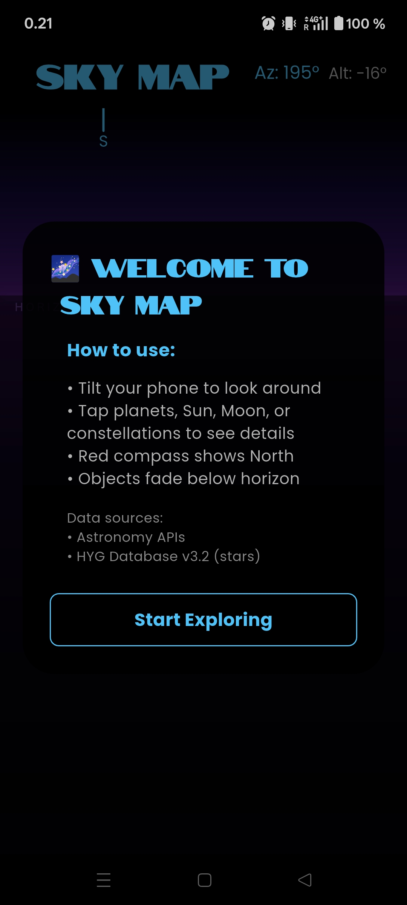
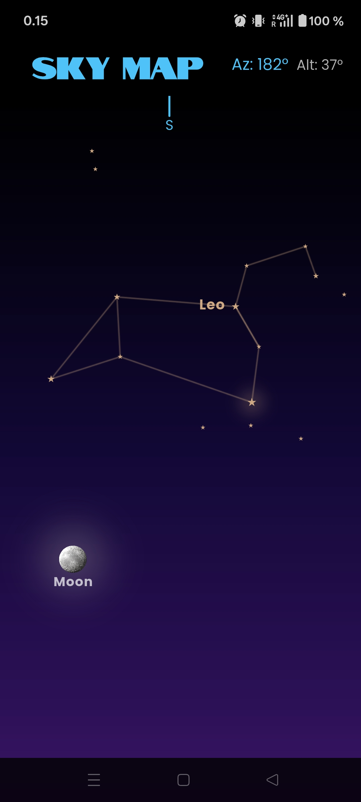
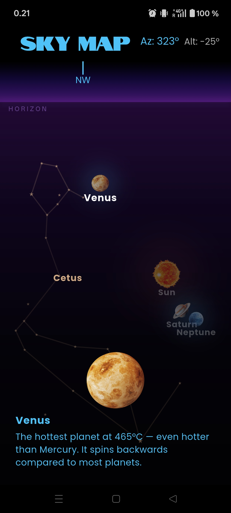
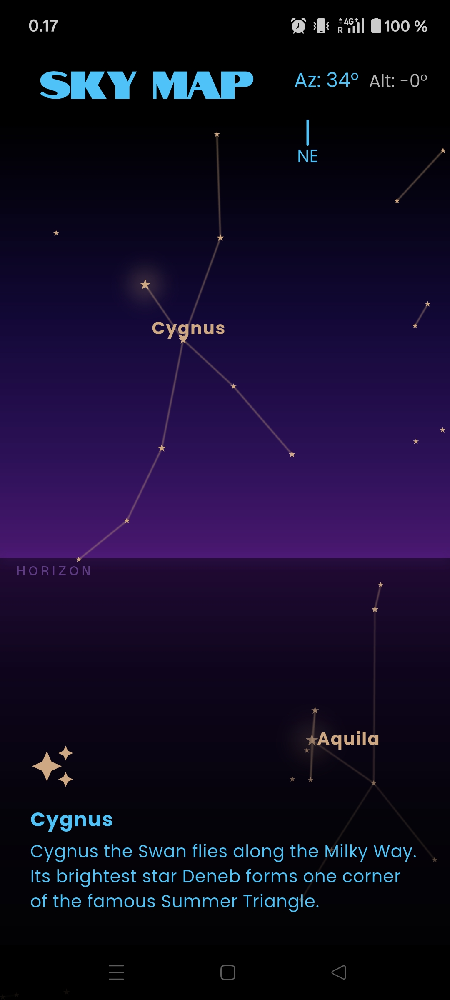

# Sky Map App

Interactive Flutter sky map using device sensors (GPS, accelerometer, magnetometer) to show real-time celestial objects from the user's location.

## Features

- Canvas repaints at 10+ FPS during active use
- Sun, Moon, all planets, stars, 11 constellations
- Tap objects for short descriptions
- BLoC state management
- Black canvas night-sky display
- Sensor-driven sky updates

## Screenshots

   

## Data Sources

- HYG Database v3.2 for star data
- Astronomy APIs or valid local files for additional celestial data
- Custom JSON file for constellation line connections

## Tech Stack

- Flutter
- CustomPainter
- flutter_bloc (BLoC pattern)
- sensors_plus
- geolocator
- astronomia
- http (AstronomyAPI requests)

## Requirements Met

- Uses GPS, accelerometer, and magnetometer for location and orientation.
- Updates the sky map in real time at 10+ FPS.
- Displays celestial objects on a black canvas.
- Allows users to tap objects and view descriptions.
- Uses the BLoC pattern for state management.
- Shows the Sun, Moon, all planets, stars, and 11 constellations.

## Usage

Tilt the phone to explore the sky. Tap planets, the Sun, the Moon, or constellations to see details. The red compass marker shows North.

## Author
[Mayuree reunsati](https://github.com/mareerray)